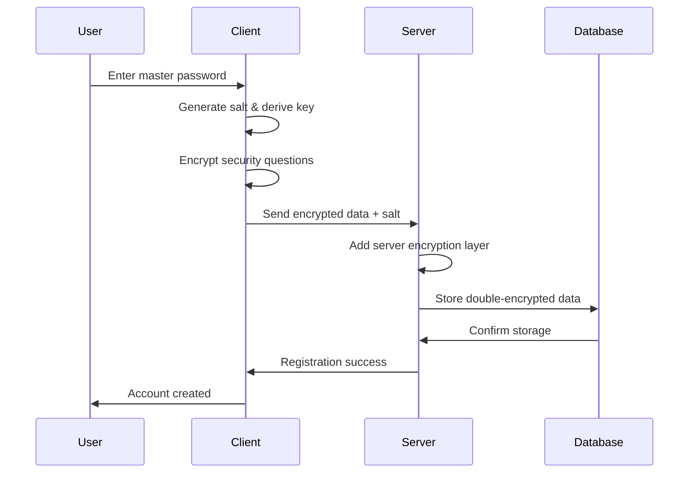
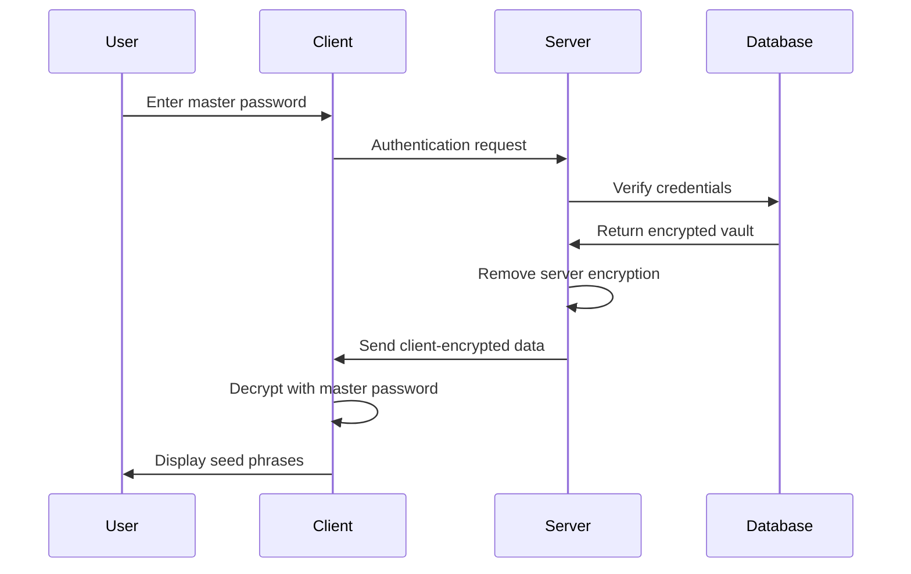

# VaultSeed Architecture

## 🏗️ System Overview

VaultSeed implements a zero-knowledge architecture where sensitive data is encrypted client-side before ever leaving the user's device. This ensures that even VaultSeed operators cannot access user seed phrases.

```
┌─────────────────────────────────────────┐
│ Client (Browser)                        │
│ ├─ Master Password (never sent)         │
│ ├─ Client-side encryption (AES-GCM)     │
│ ├─ Key derivation (PBKDF2)              │
│ └─ Encrypted payload → Server           │
└─────────────────────────────────────────┘
                    ↓ HTTPS/TLS 1.3
┌─────────────────────────────────────────┐
│ Server (Node.js/Express)                │
│ ├─ JWT Authentication                   │
│ ├─ Rate limiting & DDoS protection      │
│ ├─ Additional encryption layer          │
│ ├─ Input validation & sanitization      │
│ └─ Encrypted data → Database            │
└─────────────────────────────────────────┘
                    ↓ Encrypted Connection
┌─────────────────────────────────────────┐
│ Database (MongoDB Atlas)                │
│ ├─ Encrypted at rest                    │
│ ├─ No plaintext seed phrases            │
│ ├─ Audit logs                           │
│ └─ Regular encrypted backups            │
└─────────────────────────────────────────┘
```

## 🔐 Encryption Architecture

### Client-Side Encryption (Primary Layer)
```typescript
// 1. Key Derivation
const salt = crypto.getRandomValues(new Uint8Array(16));
const key = await crypto.subtle.deriveKey(
  {
    name: "PBKDF2",
    salt: salt,
    iterations: 500000,
    hash: "SHA-256"
  },
  keyMaterial,
  { name: "AES-GCM", length: 256 },
  false,
  ["encrypt", "decrypt"]
);

// 2. Encryption
const iv = crypto.getRandomValues(new Uint8Array(12));
const encrypted = await crypto.subtle.encrypt(
  { name: "AES-GCM", iv },
  key,
  data
);
```

### Server-Side Encryption (Additional Layer)
```javascript
// Additional encryption layer for defense in depth
const serverSalt = crypto.randomBytes(32);
const serverKey = crypto.pbkdf2Sync(
  userPassword + serverSecret,
  serverSalt,
  600000,
  32,
  'sha512'
);
const serverEncrypted = crypto.createCipher('aes-256-gcm', serverKey);
```

## 🛡️ Security Layers

### 1. Transport Security
- **TLS 1.3**: All communications encrypted in transit
- **HSTS**: HTTP Strict Transport Security enabled
- **Certificate Pinning**: Prevents man-in-the-middle attacks

### 2. Application Security
- **Zero-Knowledge**: Server never sees plaintext data
- **Double Encryption**: Client + Server encryption layers
- **Key Isolation**: Encryption keys never stored or transmitted

### 3. Authentication & Authorization
- **JWT Tokens**: Stateless authentication
- **Multi-Factor**: Security questions as second factor
- **Account Lockout**: Brute force protection

### 4. Rate Limiting & DDoS Protection
```javascript
// Adaptive rate limiting
const authLimiter = rateLimit({
  windowMs: 15 * 60 * 1000, // 15 minutes
  max: (req) => {
    // Reduce limits for repeated failures
    const failures = getFailureCount(req.ip);
    return Math.max(5 - failures, 1);
  }
});
```

## 📊 Data Flow

### User Registration


### Vault Access


## 🏛️ Component Architecture

### Frontend (React + TypeScript)
```
src/
├── components/          # Reusable UI components
├── utils/
│   ├── crypto.ts       # Client-side encryption
│   └── storage.ts      # Local storage management
├── types/              # TypeScript definitions
└── App.tsx            # Main application
```

### Backend (Node.js + Express)
```
server/
├── models/             # Database schemas
│   ├── User.js        # User authentication
│   ├── Vault.js       # Encrypted vault storage
│   └── AuditLog.js    # Security audit logs
├── routes/             # API endpoints
│   ├── auth.js        # Authentication routes
│   └── vault.js       # Vault management
├── middleware/         # Security middleware
│   ├── auth.js        # JWT verification
│   └── security.js    # Rate limiting, validation
├── utils/
│   └── encryption.js  # Server-side encryption
└── server.js          # Express application
```

## 🔄 State Management

### Client State
- **Authentication**: JWT tokens, user session
- **Vault Data**: Encrypted seed phrases (memory only)
- **UI State**: Form data, loading states, errors

### Server State
- **User Sessions**: JWT validation
- **Rate Limiting**: Request counters per IP
- **Audit Logs**: Security event tracking

## 📈 Scalability Considerations

### Horizontal Scaling
- **Stateless Design**: No server-side sessions
- **Database Sharding**: User-based partitioning
- **CDN Distribution**: Global content delivery

### Performance Optimization
- **Client-Side Caching**: Encrypted vault caching
- **Database Indexing**: Optimized queries
- **Compression**: Gzip/Brotli compression

## 🔍 Monitoring & Observability

### Security Monitoring
- **Failed Login Attempts**: Real-time alerting
- **Suspicious Patterns**: Automated detection
- **Audit Trail**: Complete activity logging

### Performance Monitoring
- **Response Times**: API endpoint monitoring
- **Error Rates**: Application health tracking
- **Resource Usage**: Server performance metrics

## 🚀 Deployment Architecture

### Development
```
Local Development → GitHub → Netlify (Frontend)
                          → Railway/Heroku (Backend)
```

### Production
```
GitHub → CI/CD Pipeline → Docker Containers → Cloud Provider
                       → MongoDB Atlas (Database)
                       → Cloudflare (CDN/Security)
```

## 🔐 Security Assumptions

### Trust Model
- **User Device**: Trusted (client-side encryption)
- **Network**: Untrusted (TLS protection)
- **Server**: Semi-trusted (additional encryption)
- **Database**: Untrusted (encrypted at rest)

### Threat Model
- **Protected Against**:
  - Server compromise
  - Database breach
  - Network interception
  - Brute force attacks
  - Timing attacks

- **Not Protected Against**:
  - Client device compromise
  - User password disclosure
  - Physical device access
  - Social engineering

## 📋 Compliance & Standards

### Security Standards
- **OWASP Top 10**: Full compliance
- **NIST Cybersecurity Framework**: Aligned
- **SOC 2 Type II**: Preparation in progress

### Privacy Regulations
- **GDPR**: Privacy by design
- **CCPA**: California privacy compliance
- **Data Minimization**: Only necessary data collected

---

This architecture ensures that VaultSeed maintains the highest security standards while providing a seamless user experience. The zero-knowledge design means that even in the worst-case scenario of a complete server compromise, user seed phrases remain secure.